# Dossier de conception — Backend findMe (GeoLink Africa)

Projet 6 — Développeur Backend Java / Spring Boot. Ce document est la source de vérité
architecturale du backend et couvre les livrables L2 attendus par le cahier des charges
(section 4) : diagrammes, MCD/MPD, matrice RBAC, stratégie de sécurité, stratégie
transactionnelle, organisation des packages, conventions REST, stratégie de tests.

Sources utilisées : `PROJET_6_Developpeur_Backend_Java_SpringBoot.pdf` (spécification
normative du contrat d'API, section 2) et `docs/frontend-api-contract.md` (audit du code
frontend réel du Projet 4).

> **Décision de cadrage** : l'audit du frontend (`docs/frontend-api-contract.md`) montre que
> le code actuel du Projet 4 fonctionne en grande partie sur `localStorage` et utilise des
> noms de champs anglais divergents du PDF. Le PDF étant la spécification normative et
> versionnée du Projet 6, **c'est ce contrat (section 2 du PDF) qui est implémenté ici**,
> et non le code frontend existant tel quel. Les deux endpoints RBAC "modifier le rôle" /
> "désactiver un compte" (section 2.4) n'ont pas de route dédiée dans les endpoints figés du
> PDF (section 2.1) : ils sont ajoutés en extension additive (`PATCH /api/admin/users/{id}/role`,
> `PATCH /api/admin/users/{id}/status`), sans toucher aux routes existantes — le frontend actuel
> ne les appelle pas, donc aucun risque de régression.

---

## 1. Diagramme de contexte

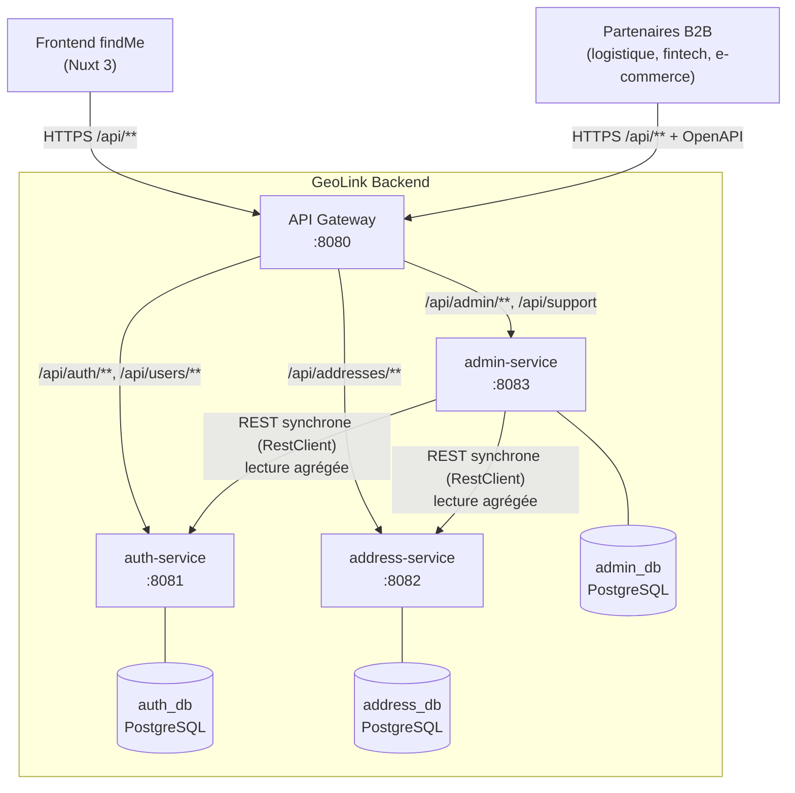

**Points clés :**
- Un seul point d'entrée public : l'API Gateway (port 8080), seul service exposé côté hôte
  dans `docker-compose.yml`. Les 3 microservices ne sont joignables que sur le réseau Docker
  interne — défense en profondeur en plus de la validation JWT.
- Pattern *database-per-service* strict : aucune base n'est partagée, aucune FK inter-service
  au niveau SQL (`address_db.addresses.user_id` est une référence logique, pas une FK physique
  vers `auth_db.users`).
- `admin-service` ne duplique aucune donnée métier : il interroge `auth-service` et
  `address-service` à la demande (appels REST synchrones) pour construire ses vues agrégées.

---

## 2. Diagramme de composants (architecture Clean/Hexagonale)

Les 3 microservices métier partagent la même stratification en 4 couches. `api-gateway` est
volontairement plus simple (pas de domaine métier propre : routage + sécurité transversale).

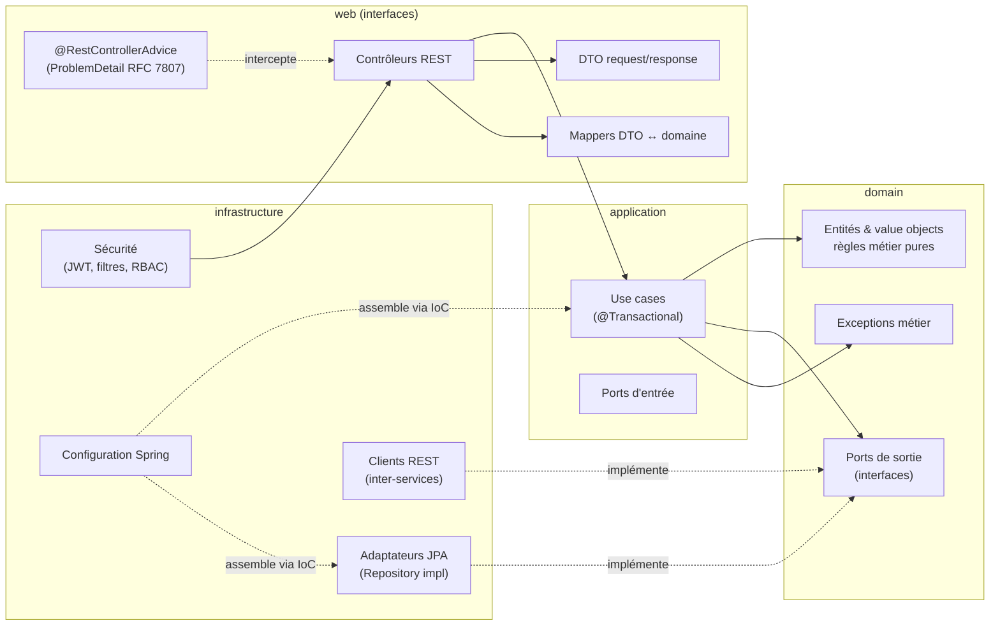

**Règle de dépendance (inversion de dépendances, SOLID/D)** : `domain` ne dépend de rien
(aucune annotation Spring/JPA). `application` dépend uniquement de `domain` (ports). `web` et
`infrastructure` dépendent de `application`/`domain`, jamais l'inverse. Les adaptateurs
(`infrastructure`) implémentent les ports définis dans `domain`, injectés par Spring IoC —
c'est ce qui permet de tester les use cases avec des mocks Mockito sans démarrer de contexte
Spring ni de base de données.

---

## 3. Diagramme de classes (modèle de domaine)

### 3.1 auth-service

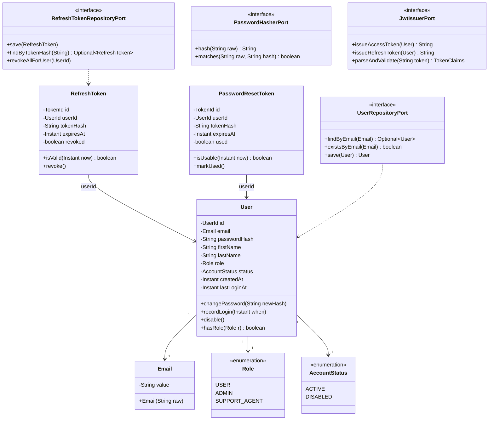

### 3.2 address-service

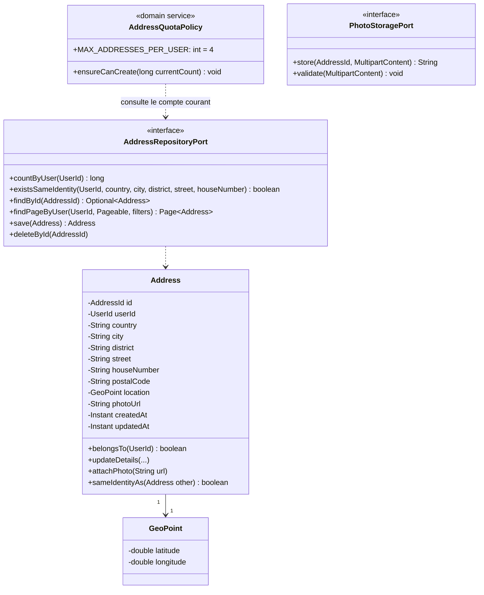

### 3.3 admin-service


`UserSummary`/`AddressSummary` ne sont **pas** des entités persistées : ce sont des objets de
lecture reconstruits à chaque appel depuis les réponses REST de `auth-service`/`address-service`
(pas de duplication de données métier, conformément à la section 2.3 du cahier des charges).

---

## 4. Diagrammes de séquence

### 4.1 Inscription (signup)

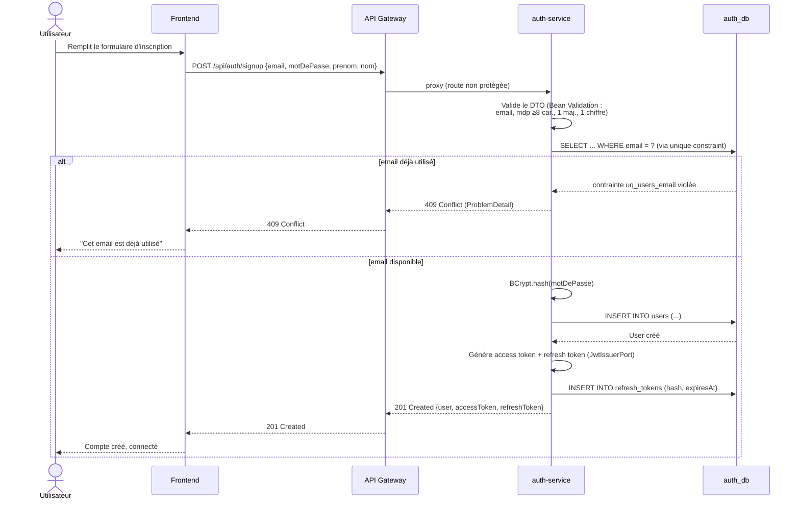

### 4.2 Connexion avec émission du JWT (signin)

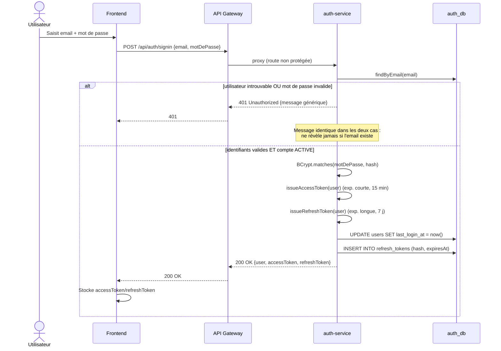

### 4.3 Création d'une adresse avec vérification du quota

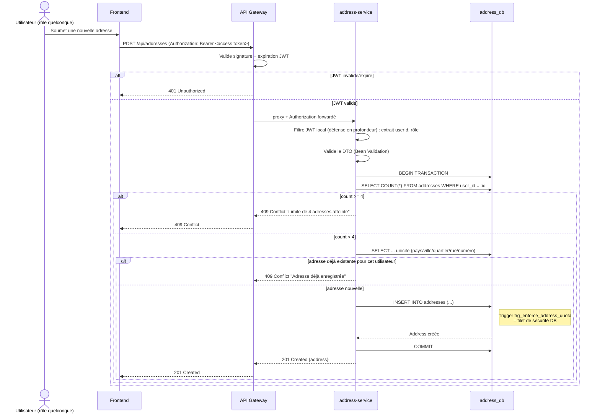

### 4.4 Consultation admin agrégée (appel inter-services)

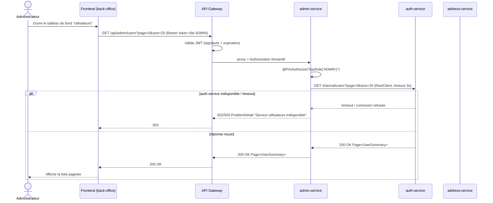

---

## 5. Modèle de données (MCD/MPD)

### 5.1 auth_db

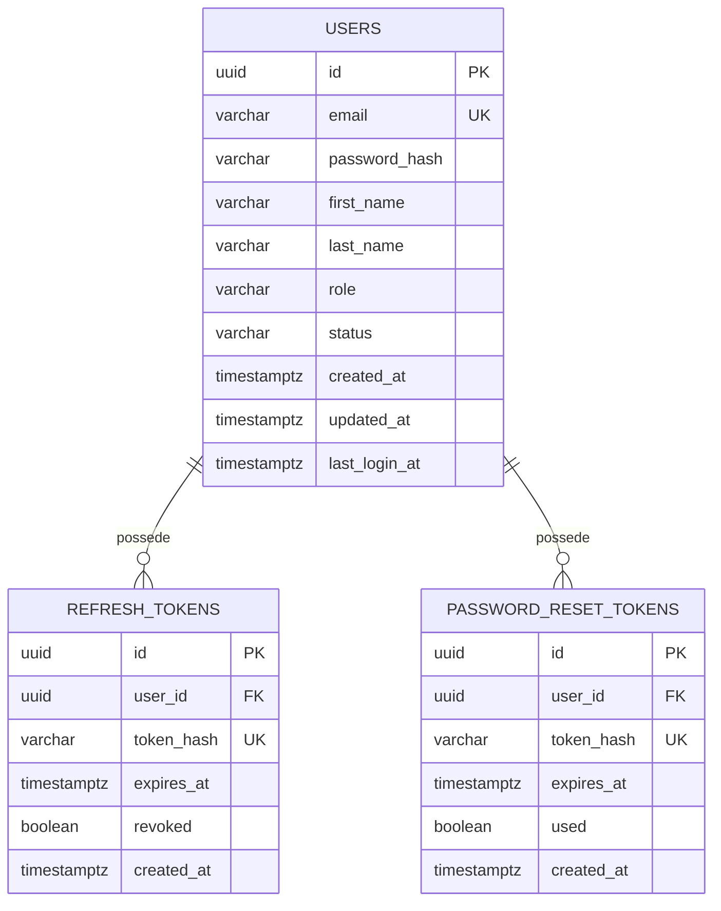

### 5.2 address_db

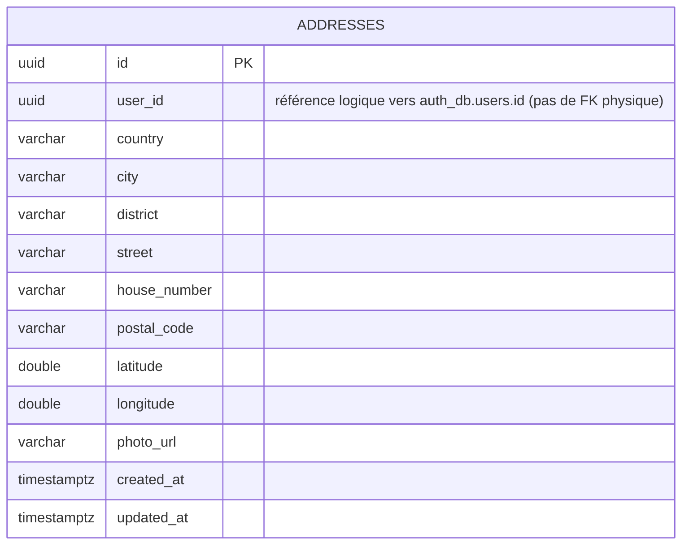
Contrainte `UNIQUE (user_id, country, city, district, street, house_number)` +
trigger `trg_enforce_address_quota` (voir `V2__enforce_address_quota_trigger.sql`).

### 5.3 admin_db

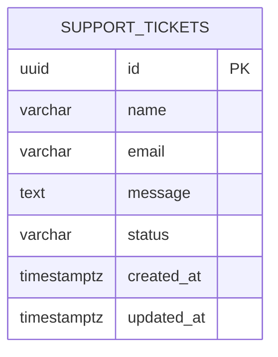
`admin_db` ne contient **aucune table users/addresses** — uniquement les tickets de support,
conformément au principe "pas de duplication de données métier".

---

## 6. Matrice RBAC complète

Légende : ✅ autorisé · 🔒 uniquement sur sa propre ressource · ❌ interdit · 🌐 public (pas de JWT requis).

| Endpoint | Méthode | Public | USER | SUPPORT_AGENT | ADMIN |
|---|---|:---:|:---:|:---:|:---:|
| `/api/auth/signup` | POST | 🌐 | 🌐 | 🌐 | 🌐 |
| `/api/auth/signin` | POST | 🌐 | 🌐 | 🌐 | 🌐 |
| `/api/auth/refresh` | POST | 🌐 (token valide requis) | ✅ | ✅ | ✅ |
| `/api/auth/logout` | POST | ❌ | ✅ | ✅ | ✅ |
| `/api/auth/forgot-password` | POST | 🌐 | 🌐 | 🌐 | 🌐 |
| `/api/auth/reset-password` | POST | 🌐 (token à usage unique) | 🌐 | 🌐 | 🌐 |
| `/api/users/me` | GET | ❌ | 🔒 | 🔒 | 🔒 |
| `/api/users/me` | PUT | ❌ | 🔒 | 🔒 | 🔒 |
| `/api/addresses` | GET | ❌ | 🔒 | 🔒 | 🔒 |
| `/api/addresses` | POST | ❌ | 🔒 (quota 4) | 🔒 (quota 4) | 🔒 (quota 4) |
| `/api/addresses/{id}` | GET | ❌ | 🔒 propriétaire | 🔒 propriétaire | 🔒 propriétaire |
| `/api/addresses/{id}` | PUT | ❌ | 🔒 propriétaire | 🔒 propriétaire | 🔒 propriétaire |
| `/api/addresses/{id}` | DELETE | ❌ | 🔒 propriétaire | 🔒 propriétaire | 🔒 propriétaire |
| `/api/addresses/{id}/photo` | POST | ❌ | 🔒 propriétaire | 🔒 propriétaire | 🔒 propriétaire |
| `/api/addresses/{id}/export` | GET | ❌ | 🔒 propriétaire | 🔒 propriétaire | 🔒 propriétaire |
| `/api/admin/users` | GET | ❌ | ❌ | ❌ | ✅ |
| `/api/admin/addresses` | GET | ❌ | ❌ | ❌ | ✅ |
| `/api/support` | POST | 🌐 | 🌐 | 🌐 | 🌐 |
| `/api/admin/support` | GET | ❌ | ❌ | ✅ | ✅ |
| `/api/admin/support/{id}` | PATCH | ❌ | ❌ | ✅ | ✅ |
| `/api/admin/users/{id}/role` *(additif)* | PATCH | ❌ | ❌ | ❌ | ✅ |
| `/api/admin/users/{id}/status` *(additif)* | PATCH | ❌ | ❌ | ❌ | ✅ |

Règles transversales :
- 🔒 « propriétaire » : le use case vérifie systématiquement `address.belongsTo(currentUserId)`
  avant lecture/écriture/suppression → sinon `403 Forbidden` (jamais `404`, pour ne pas fuiter
  l'existence de la ressource... *mais* le cahier des charges section 2.2 impose explicitement
  `404 Not Found` pour une adresse inexistante et `403 Forbidden` pour un accès à l'adresse
  d'un autre utilisateur : ces deux cas sont donc bien distingués, dans cet ordre — existence
  vérifiée avant propriété).
- Les rôles sont portés par la claim `role` du JWT et vérifiés via `@PreAuthorize("hasRole('ADMIN')")`
  (ou équivalent) sur chaque contrôleur/méthode sensible — jamais uniquement côté Gateway.

---

## 7. Stratégie de sécurité (JWT & RBAC)

### 7.1 Cycle de vie du token

- **Émission** : uniquement par `auth-service`, à l'issue de `signin` ou `signup`. Deux tokens :
  - **Access token** (JWT signé HMAC-SHA256, claims : `sub`=userId, `email`, `role`, `exp`) —
    durée de vie courte (15 min, configurable via `JWT_ACCESS_TTL_MINUTES`).
  - **Refresh token** (chaîne aléatoire opaque de 256 bits, `SecureRandom` — pas un JWT — dont
    seul le hash SHA-256 est persisté en base `refresh_tokens`, jamais le token en clair) — durée
    de vie longue (7 jours), **rotation à chaque refresh** :
    l'ancien est révoqué (`revoked=true`) et un nouveau est émis, ce qui permet de détecter le
    rejeu d'un refresh token volé (s'il est présenté après avoir déjà été utilisé une fois, tous
    les tokens de l'utilisateur sont révoqués par précaution).
- **Validation** : **défense en profondeur à deux niveaux**, justifiée par le cahier des charges
  (section 2.4 : « validé par chaque service, ou par la Gateway, selon le choix retenu ») :
  1. L'API Gateway valide en premier la signature et l'expiration (rejet rapide, réponse 401
     homogène, évite de solliciter les services métier pour un token manifestement invalide).
  2. Chaque microservice **revalide indépendamment** le même JWT (même secret partagé via la
     variable d'environnement `JWT_SECRET`) avant d'appliquer son propre `@PreAuthorize`. Ce choix
     évite de faire aveuglément confiance au réseau interne Docker (principe *zero trust* même en
     interne) sans nécessiter de bibliothèque partagée versionnée entre services (chaque service
     reste déployable indépendamment — on accepte une petite duplication de code de validation JWT
     au profit de l'indépendance des microservices).
- **Révocation** : `logout` révoque le refresh token courant. `POST /api/admin/users/{id}/status`
  (désactivation de compte) invalide implicitement toute nouvelle tentative de refresh (vérification
  `status == ACTIVE` à chaque `refresh`/`signin`), même si un access token de courte durée reste
  valable jusqu'à son expiration naturelle (compromis assumé : 15 min max, documenté comme
  limitation connue dans le rapport de sécurité L9).
- **Stockage côté client** : hors périmètre backend (frontend), mais le contrat impose que le
  token soit transmis en en-tête `Authorization: Bearer <token>` — jamais en query param (fuite
  possible dans les logs/proxies).

### 7.2 Protection des endpoints

- `SecurityFilterChain` par service : tout endpoint est protégé par défaut (`anyRequest().authenticated()`),
  seules les routes listées en section 6 comme 🌐 sont explicitement `permitAll()`.
- `@PreAuthorize("hasRole('ADMIN')")` / `hasAnyRole('ADMIN','SUPPORT_AGENT')` au niveau méthode
  des contrôleurs `admin-service`, en plus du filtrage par la Gateway sur le préfixe `/api/admin/**`.
- Vérification de propriété (adresses) : effectuée dans la couche `application` (use case), pas
  dans le contrôleur — c'est une règle métier, pas un détail HTTP.

### 7.3 Hashing & secrets

- Mots de passe : `BCrypt` (coût 10, `org.springframework.security.crypto.bcrypt.BCryptPasswordEncoder`),
  jamais loggés (les DTO de requête excluent le mot de passe des `toString()`/logs applicatifs).
- Tokens de réinitialisation : générés aléatoirement (`SecureRandom`, 32 octets, encodés base64url),
  seul leur hash SHA-256 est persisté — usage unique, expiration 30 min.
- Secrets (`JWT_SECRET`, identifiants PostgreSQL) : jamais en dur dans le code ni dans les images
  Docker — injectés via variables d'environnement (`docker-compose.yml` + `.env`, `.env` exclu du
  contrôle de version).

---

## 8. Stratégie de gestion des transactions

- **Périmètre `@Transactional`** : posé au niveau de la couche `application` (use cases), jamais
  dans les contrôleurs ni les repositories — un use case = une unité transactionnelle cohérente.
  Exemples : `SignupUseCase` (vérification unicité + insertion utilisateur + première émission de
  refresh token), `CreateAddressUseCase` (comptage du quota + vérification d'unicité + insertion,
  dans la même transaction pour éviter une *race condition* entre la lecture du compte et l'écriture).
- **Isolation** : niveau par défaut PostgreSQL (`READ COMMITTED`) jugé suffisant car le quota de 4
  adresses est protégé par un filet de sécurité supplémentaire au niveau base (trigger
  `trg_enforce_address_quota`, section 5.2) qui absorbe le cas limite d'une double requête
  concurrente sur le même compte (la transaction perdante échoue proprement avec une exception
  applicative traduite en `409 Conflict`, plutôt que de produire une 5ᵉ adresse).
- **Erreurs partielles (admin-service)** : les appels REST vers `auth-service`/`address-service`
  ne sont **jamais** inclus dans une transaction locale (ce sont des lectures, pas des écritures
  distribuées — pas de need de saga/2PC). En cas d'échec/timeout d'un service appelé, `admin-service`
  retourne une erreur `503 Service Unavailable` avec un `ProblemDetail` explicite, sans jamais
  planter (`RestClient` configuré avec un timeout de connexion et de lecture de 3s, capturé par un
  `try/catch` dédié dans l'adaptateur `infrastructure/client`).
- **Rollback** : toute exception métier non contrôlée (`RuntimeException`) déclenche un rollback
  automatique Spring ; les exceptions métier attendues (ex. `EmailAlreadyUsedException`,
  `AddressQuotaExceededException`) sont volontairement des `RuntimeException` pour bénéficier de ce
  comportement par défaut, traduites ensuite en code HTTP par le `@RestControllerAdvice`.

---

## 9. Organisation des packages (arborescence type)

Identique pour `auth-service`, `address-service`, `admin-service` (illustration avec `auth-service`) :

```
auth-service/
└── src/main/java/com/geolink/findme/auth/
    ├── AuthServiceApplication.java
    ├── domain/
    │   ├── model/            # User, Email, Role, AccountStatus, RefreshToken, PasswordResetToken
    │   ├── port/              # UserRepositoryPort, RefreshTokenRepositoryPort, PasswordHasherPort, JwtIssuerPort
    │   └── exception/         # EmailAlreadyUsedException, InvalidCredentialsException, ...
    ├── application/
    │   └── usecase/           # SignupUseCase, SigninUseCase, RefreshTokenUseCase, LogoutUseCase,
    │                           # ForgotPasswordUseCase, ResetPasswordUseCase, GetMyProfileUseCase, UpdateMyProfileUseCase
    ├── infrastructure/
    │   ├── persistence/        # UserJpaEntity, UserJpaRepository, UserRepositoryAdapter, ...
    │   ├── security/            # JwtService (impl JwtIssuerPort), JwtAuthenticationFilter, SecurityConfig
    │   └── config/               # OpenApiConfig, BeanConfig (PasswordEncoder, RestClient si besoin)
    └── web/
        ├── controller/          # AuthController, UserController
        ├── dto/                 # SignupRequest, SigninRequest, AuthResponse, UserProfileResponse, ...
        ├── mapper/              # UserWebMapper
        └── advice/               # GlobalExceptionHandler (ProblemDetail)
```

`api-gateway` (structure allégée, pas de couche domaine métier) :
```
api-gateway/
└── src/main/java/com/geolink/findme/gateway/
    ├── ApiGatewayApplication.java
    ├── config/        # RouteProperties (mapping préfixe → base URL), RestClientConfig
    ├── security/      # GatewayJwtFilter (validation signature/expiration avant proxy)
    └── web/           # ProxyController (routage générique par préfixe de chemin)
```

---

## 10. Conventions REST retenues

- **Nommage des ressources** : substantifs pluriels (`/api/addresses`), imbrication limitée à un
  niveau pour les sous-ressources (`/api/addresses/{id}/photo`).
- **Verbes HTTP** : `GET` (lecture, idempotent), `POST` (création ou action non idempotente comme
  l'upload), `PUT` (remplacement complet d'une ressource existante), `PATCH` (modification
  partielle — utilisé pour le statut d'un ticket ou d'un compte), `DELETE` (suppression).
- **Codes de statut** : `200` lecture/mise à jour réussie, `201` création (avec header `Location`),
  `204` suppression réussie sans corps, `400` requête invalide (Bean Validation), `401` non
  authentifié/token invalide, `403` authentifié mais non autorisé, `404` ressource inexistante,
  `409` conflit métier (email dupliqué, quota, adresse dupliquée), `422` (réservé pour une
  validation métier complexe multi-champs si besoin futur), `500` erreur non anticipée.
- **Pagination** : paramètres `page` (0-indexé) et `size`, mappés directement sur `Pageable` de
  Spring Data ; `sort` au format `champ,asc|desc`. Réponse de liste = `Page<T>` sérialisé par
  Spring (`content`, `totalElements`, `totalPages`, `number`, `size`) — pas d'enveloppe `{success,data}`
  personnalisée (voir décision de cadrage en tête de document).
- **Filtrage** : query params nommés d'après le domaine métier (`pays`, `ville`, `quartier`,
  `statut`), toujours optionnels, combinables.
- **Erreurs** : format homogène `ProblemDetail` (RFC 7807) via `@RestControllerAdvice` central par
  service — `type`, `title`, `status`, `detail`, `instance`, et une extension `errorCode` (ex.
  `EMAIL_ALREADY_USED`, `ADDRESS_QUOTA_EXCEEDED`) exploitable par le frontend sans parser le message.
- **Versionnement** : non appliqué dans cette itération (contrat figé, un seul consommateur
  officiel) ; si nécessaire plus tard, stratégie recommandée = préfixe d'URI (`/api/v2/...`)
  plutôt qu'un header, pour rester lisible par les partenaires B2B.
- **DTO systématiques** : aucune entité JPA ni objet de domaine n'est jamais sérialisé directement
  ; chaque contrôleur ne connaît que des DTO `web/dto`, mappés explicitement (mappers manuels,
  pas de bibliothèque de mapping magique, pour rester lisible en contexte pédagogique).

---

## 11. Stratégie de tests

**Pyramide visée** (par service) :

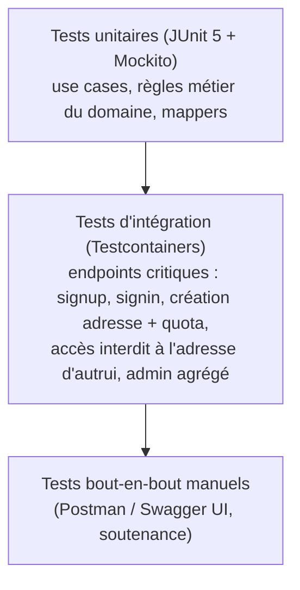

- **Tests unitaires** (majorité du volume) : ciblent `domain` et `application`, sans contexte
  Spring (`@ExtendWith(MockitoExtension.class)`), ports mockés. Couvrent explicitement les cas
  limites du cahier des charges (email dupliqué → 409, identifiants invalides → 401, quota
  dépassé → 409, accès à l'adresse d'autrui → 403, adresse inexistante → 404, token de
  réinitialisation expiré/déjà utilisé → 410/400, upload non conforme → 400).
- **Tests d'intégration** : `@SpringBootTest` + Testcontainers PostgreSQL (une instance par
  classe de test, migrations Flyway réellement exécutées) pour les endpoints critiques listés
  ci-dessus + vérification de la RBAC (`@WithMockUser`/JWT généré en test) sur les routes
  `/api/admin/**`.
- **Objectif de couverture** : ≥ 80 % sur `domain`+`application` (logique métier), ≥ 60 % global
  par service. Mesuré via `jacoco-maven-plugin` (rapport HTML dans `target/site/jacoco`), ajouté
  en semaine 4 avec les tests eux-mêmes.
- **Hors périmètre non-obligatoire** : tests de charge/performance (non demandés par le cahier
  des charges), circuit breaker (bonus explicitement optionnel).
