# Dossier de conception — Backend findMe (GeoLink Africa)

Projet 6 — Développeur Backend Java / Spring Boot. Ce document est la source de vérité
architecturale du backend et couvre les livrables L2 attendus par le cahier des charges
(section 4) : diagrammes, MCD/MPD, matrice RBAC, stratégie de sécurité, stratégie
transactionnelle, organisation des packages, conventions REST, stratégie de tests.

Sources utilisées : `PROJET_6_Developpeur_Backend_Java_SpringBoot.pdf` (spécification
normative du contrat d'API, section 2) et `docs/frontend-api-contract.md` (audit du code
frontend réel du Projet 4).

> **Décision de cadrage** : l'audit du frontend (`docs/frontend-api-contract.md`) montre que
> le code actuel du Projet 4 fonctionne en grande partie sur `localStorage` et utilise des
> noms de champs anglais divergents du PDF. Le PDF étant la spécification normative et
> versionnée du Projet 6, **c'est ce contrat (section 2 du PDF) qui est implémenté ici**,
> et non le code frontend existant tel quel. Les deux endpoints RBAC "modifier le rôle" /
> "désactiver un compte" (section 2.4) n'ont pas de route dédiée dans les endpoints figés du
> PDF (section 2.1) : ils sont ajoutés en extension additive (`PATCH /api/admin/users/{id}/role`,
> `PATCH /api/admin/users/{id}/status`), sans toucher aux routes existantes — le frontend actuel
> ne les appelle pas, donc aucun risque de régression.

> **⚠️ Écart assumé par rapport au cahier des charges — architecture** : le PDF (section 2,
> introduction ; section 2.5 ; livrable L2) impose explicitement un **découpage en 3
> microservices autonomes** (`auth-service`, `address-service`, `admin-service`), pattern
> *database-per-service*, et une **API Gateway** routant vers ces services (table de routage
> détaillée en 2.5), avec communication inter-service REST synchrone pour `admin-service`
> (section 2.3). **Ce backend a été délibérément refondu en une application 3-tiers unique**
> (une seule base PostgreSQL, pas de Gateway ni d'appel REST inter-service). Ce choix déroge
> sciemment à l'exigence structurelle du PDF (microservices + Gateway), tout en respectant
> strictement l'exigence *fonctionnelle* non négociable du même document : *« Aucune régression
> de contrat : chaque endpoint doit produire exactement les formats attendus par le frontend »*
> (section 2, dernière page) — les routes, DTO, codes HTTP et règles métier (quota de 4 adresses,
> unicité email, RBAC, etc.) sont restés strictement identiques à l'implémentation microservices
> d'origine. Les sections 1, 2, 4, 5, 7, 8 et 9 ci-dessous décrivent l'architecture 3-tiers
> réellement en place ; elles ne décrivent donc plus le découpage microservices attendu par le
> PDF section 2.
>
> **Preuve de compétence, pas d'évitement** : l'architecture microservices complète a été
> construite en premier (`api-gateway` + `auth-service` + `address-service` + `admin-service`,
> Clean/Hexagonale par service, database-per-service, appels REST inter-services synchrones —
> voir l'historique Git, commits antérieurs à `91c7657`). La fusion n'est donc pas une
> impossibilité technique mais un choix d'ingénieur pris en connaissance de cause, après avoir
> livré et fait fonctionner les deux versions.
>
> **Pourquoi la fusion — trois arguments techniques, pas un confort personnel :**
> 1. *Pas de véritable frontière d'échelle ou d'équipe.* Les microservices se justifient quand des
>    domaines doivent scaler ou se déployer indépendamment, ou quand des équipes séparées ont
>    besoin de cycles de release découplés (loi de Conway). Ici : un seul développeur, un seul
>    cycle de release, une cible de 25 000 utilisateurs actifs — un volume qu'une seule instance
>    Spring Boot + un seul PostgreSQL encaissent sans tension, sans qu'aucun domaine (auth,
>    adresses, admin) n'ait un profil de charge distinct des autres.
> 2. *Le découpage forçait un anti-pattern « monolithe distribué ».* `admin-service` devait
>    appeler `auth-service` et `address-service` en REST synchrone pour de simples lectures
>    agrégées (section 2.3 du PDF) : un couplage fort entre services, mais payé en latence réseau,
>    en gestion de timeout/503 (section 2.5, 2.8), et en DTO dupliqués (`UserSummary`,
>    `AddressSummary`) — sans gagner l'indépendance de déploiement qui est la seule vraie raison
>    d'accepter ce coût.
> 3. *L'intégrité référentielle en pâtissait.* Le *database-per-service* interdisait une vraie
>    contrainte `FOREIGN KEY` entre `addresses.user_id` et `users.id` (bases distinctes) : la
>    cohérence reposait sur une référence logique non garantie par la base. Or la section 3 du
>    PDF pose elle-même comme exigence que *« les contraintes d'intégrité sont également
>    garanties au niveau base de données, pas uniquement applicatif »*. L'architecture 3-tiers
>    satisfait cette exigence-là plus strictement que ne le permettait le découpage microservices
>    d'origine.
>
> **Coût de complexité mesuré** (avant `91c7657` → après, mêmes fonctionnalités) : 194 → 96
> fichiers Java (**-51 %**), -3 723 lignes nettes (2 632 insertions / 6 355 suppressions sur
> 250 fichiers), 5 `pom.xml` → 1, 4 `Dockerfile` → 1, 4 bases PostgreSQL → 1. Cette complexité
> supprimée était de la complexité *accidentelle* (plomberie réseau, DTO de duplication, gestion
> d'indisponibilité inter-service) et non de la complexité *essentielle* liée au métier.
>
> **Compromis assumés — ce qui a été perdu :**
> - Déployabilité et scalabilité indépendantes par domaine (aucun service ne peut être mis à
>   l'échelle ou redéployé seul).
> - Isolation des pannes : un incident dans le module adresses peut désormais affecter
>   l'ensemble de l'application, alors qu'`address-service` isolait ce risque.
> - Démonstration de patterns distribués (routage Gateway, résilience inter-services) qui
>   faisaient partie des objectifs pédagogiques explicites de cet exercice.
> - Conformité littérale aux livrables L1 (dépôts organisés par microservice) et L7
>   (orchestration de 3 microservices + Gateway + 3 bases).
>
> **Réversibilité** : chaque service métier (`AuthService`, `UserService`, `AddressService`,
> `SupportService`) et chaque dépendance technique remplaçable (`JwtService`,
> `PhotoStorageService`, `QrCodeService`, `SecureTokenGenerator`) reste défini en interface +
> implémentation (inversion de dépendances, SOLID), et les packages suivent toujours les mêmes
> frontières de domaine (`auth`/`address`/`admin`). Rescinder la fusion — réextraire ces
> frontières en modules/services séparés — resterait un refactoring mécanique, pas une réécriture,
> le jour où un vrai besoin d'échelle ou d'équipe séparée apparaîtrait.

---

## 1. Diagramme de contexte

> **Historique** : ce projet a démarré en architecture microservices (`api-gateway` +
> `auth-service` + `address-service` + `admin-service`, une base PostgreSQL par service). Il a été
> refondu en une **application 3-tiers unique** (une seule base de données) pour ce livrable —
> voir la section 2 pour l'architecture interne et la section 9 pour l'organisation des packages.
> Le contrat d'API public (chemins, DTO, codes HTTP) est resté strictement identique : le frontend
> n'a rien eu à changer.

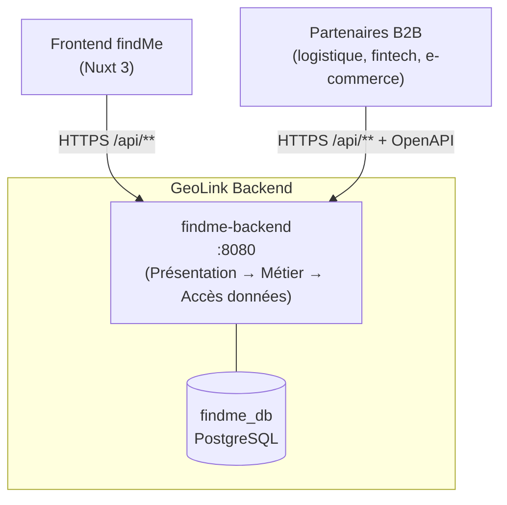

**Points clés :**
- Un seul point d'entrée public : l'application `findme-backend` (port 8080), seul conteneur
  exposé côté hôte dans `docker-compose.yml`.
- Une seule base PostgreSQL (`findme_db`) : les tables `users`, `refresh_tokens`,
  `password_reset_tokens`, `addresses`, `support_tickets` partagent le même schéma, avec de
  vraies contraintes de clé étrangère (`addresses.user_id → users.id`) — plus besoin de
  référence logique inter-base comme à l'époque microservices.
- Les vues agrégées "admin" (utilisateurs, adresses) sont construites par appel direct en mémoire
  aux services (`UserService`, `AddressService`), sans hop réseau ni endpoint interne.

---

## 2. Diagramme de composants (architecture 3-tiers)

L'application est structurée en 3 couches classiques, chacune un package racine sous
`com.geolink.findme` :

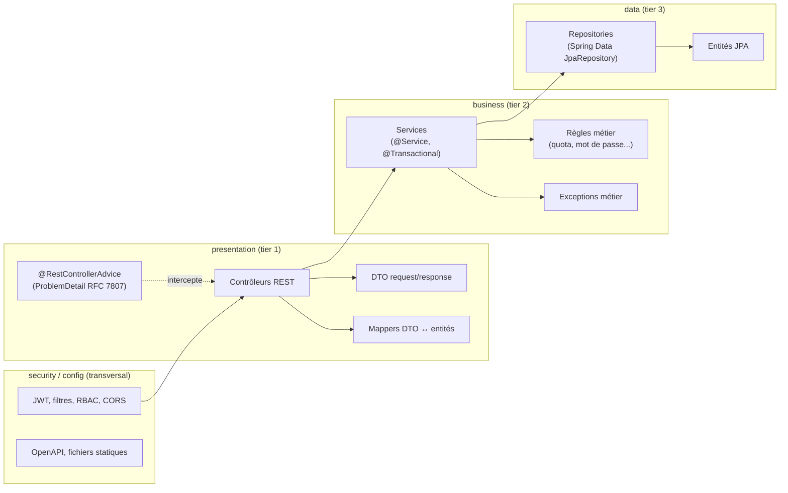

**Règle de dépendance** : `presentation` dépend de `business`, jamais l'inverse. `business`
dépend de `data` (injection directe des `JpaRepository` Spring Data, déjà des interfaces — pas
de couche d'adaptateur intermédiaire pour la persistance). `data` ne dépend de rien d'autre que
les entités JPA elles-mêmes. Les entités sont volontairement anémiques (porteuses de données +
quelques prédicats simples comme `Address.belongsTo`/`sameIdentityAs`) : la logique métier vit
dans la couche `business`, pas dans les entités ni les contrôleurs.

**Respect de SOLID — principe D (inversion des dépendances)** : chaque service métier
(`AuthService`, `UserService`, `AddressService`, `SupportService`) est défini comme une
**interface** dans `business/service`, implémentée par une classe `*Impl` du même package
(`AuthServiceImpl`, ...) — les contrôleurs de `presentation` dépendent de l'interface, jamais de
l'implémentation. Les dépendances techniques remplaçables sont traitées pareil : `PhotoStorageService`
(interface) / `FileSystemPhotoStorageService` (impl filesystem, remplaçable par un adaptateur
S3-compatible), `QrCodeService` (interface) / `ZxingQrCodeService` (impl ZXing), et dans
`security` : `JwtService` (interface) / `JwtServiceImpl`, `SecureTokenGenerator` (interface) /
`SecureTokenGeneratorImpl`. Chaque interface ne porte que les méthodes réellement consommées par
ses appelants (principe I) ; les tests unitaires mockent ces interfaces avec Mockito sans
contexte Spring ni base de données (voir `AuthServiceTest`, `AddressServiceTest`).

---

## 3. Diagramme de classes (modèle de domaine)

### 3.1 auth-service

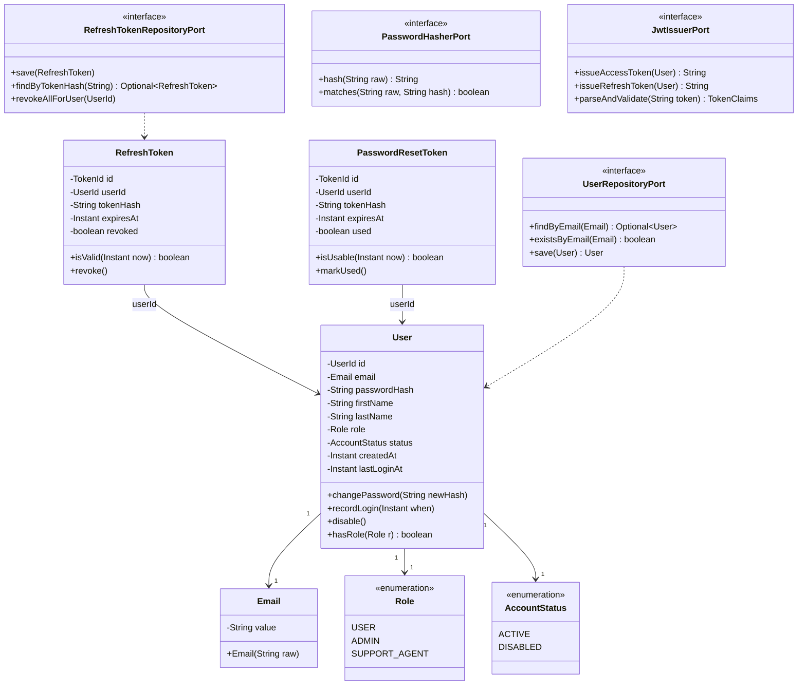

### 3.2 address-service

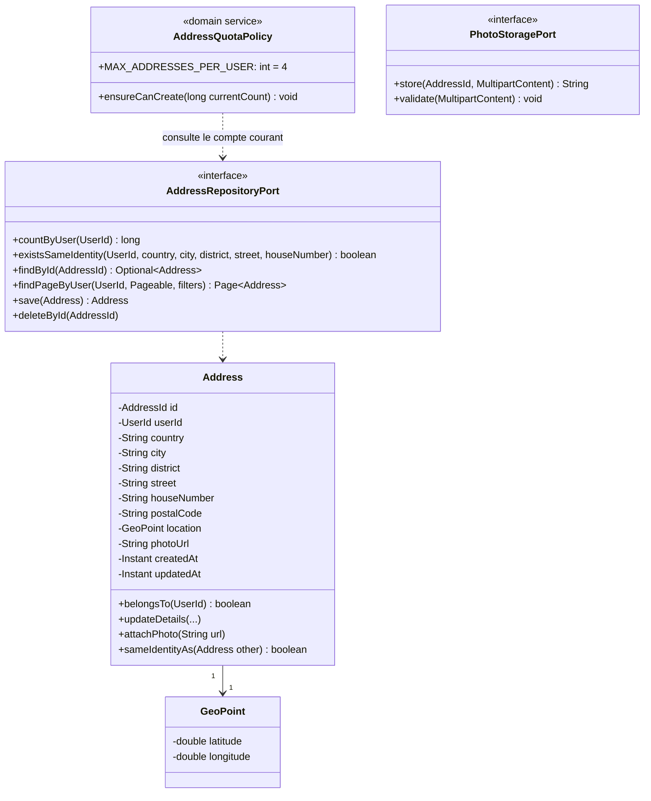

### 3.3 admin-service

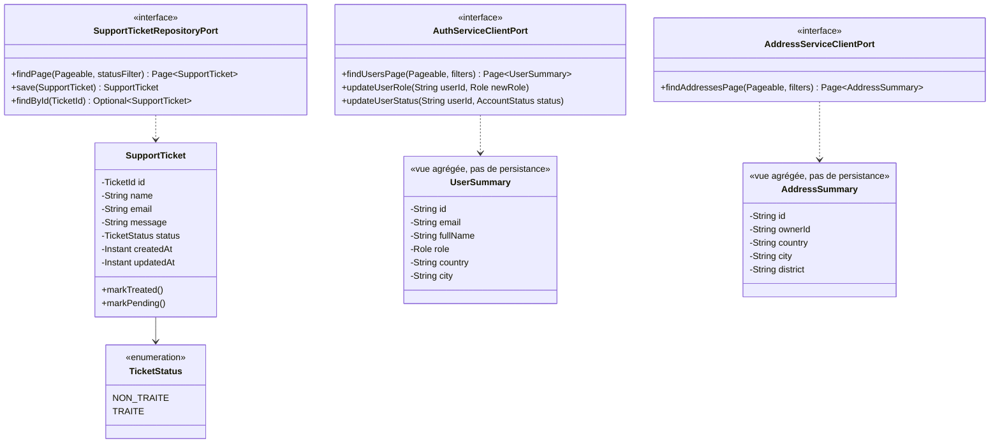

`UserSummary`/`AddressSummary` datent de l'architecture microservices (objets reconstruits depuis
les réponses REST d'`auth-service`/`address-service`). Depuis la fusion en application unique, les
vues admin (`AdminUserController`, `AdminAddressController`) lisent directement les entités
`User`/`Address` via `UserService`/`AddressService` et les mappent vers `UserProfileResponse`/
`AddressSummaryResponse` (section 9) — toujours aucune duplication de données métier
(conformément à la section 2.3 du cahier des charges), simplement sans le détour par un DTO client
REST intermédiaire.

---

## 4. Diagrammes de séquence

> **Note** : les diagrammes ci-dessous datent de l'architecture microservices et montraient un
> hop `API Gateway` avant chaque service. Ce hop a disparu avec la fusion en application unique
> (section 2) — le frontend appelle directement `findme-backend` (port 8080), qui route en
> interne vers le contrôleur puis le service concernés. Les échanges métier eux-mêmes
> (validations, transactions, codes HTTP) sont inchangés.

### 4.1 Inscription (signup)

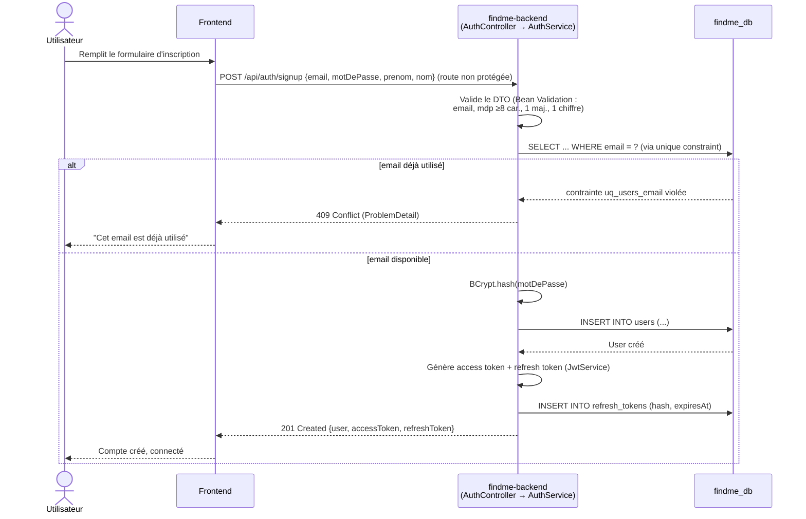

### 4.2 Connexion avec émission du JWT (signin)

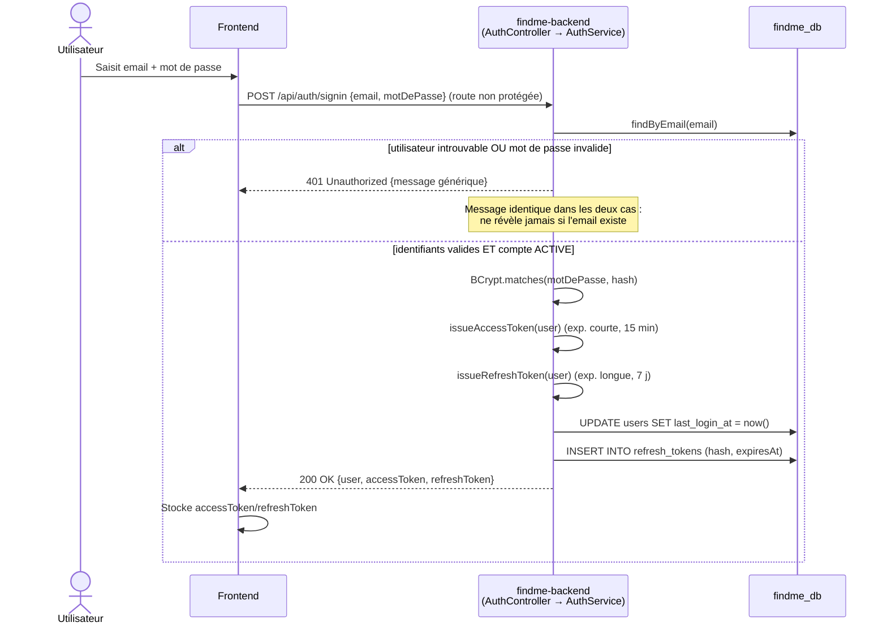

### 4.3 Création d'une adresse avec vérification du quota

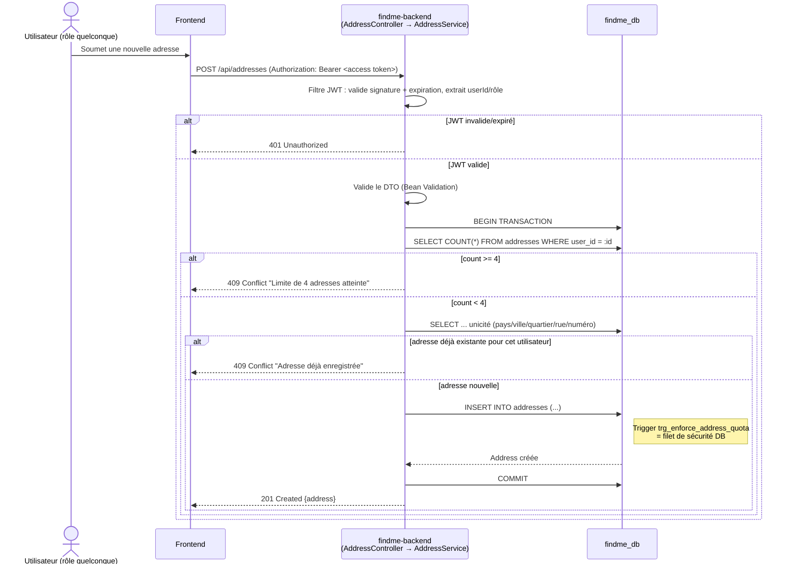

### 4.4 Consultation admin agrégée

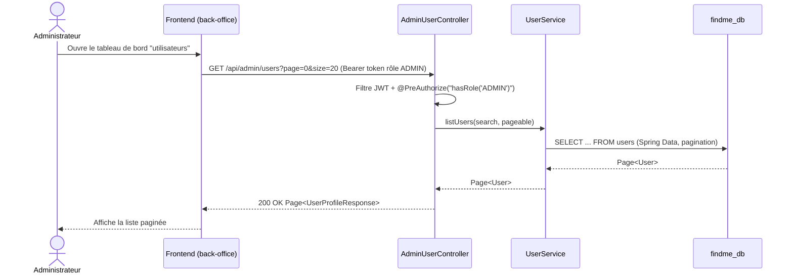

Depuis la fusion en application unique, cet appel est un simple appel de méthode en mémoire
(`AdminUserController` → `UserService` → `UserRepository`) : le scénario d'indisponibilité réseau
inter-service (timeout, 503) de l'ancienne architecture microservices n'a plus lieu d'être.

---

## 5. Modèle de données (MCD/MPD)

Toutes les tables ci-dessous vivent dans la même base `findme_db` (migrations Flyway
`V1`–`V9`, voir `src/main/resources/db/migration`) ; le regroupement par sous-section reflète
uniquement le domaine fonctionnel (auth / adresses / support), pas une séparation physique.

### 5.1 Domaine authentification (users, refresh_tokens, password_reset_tokens)

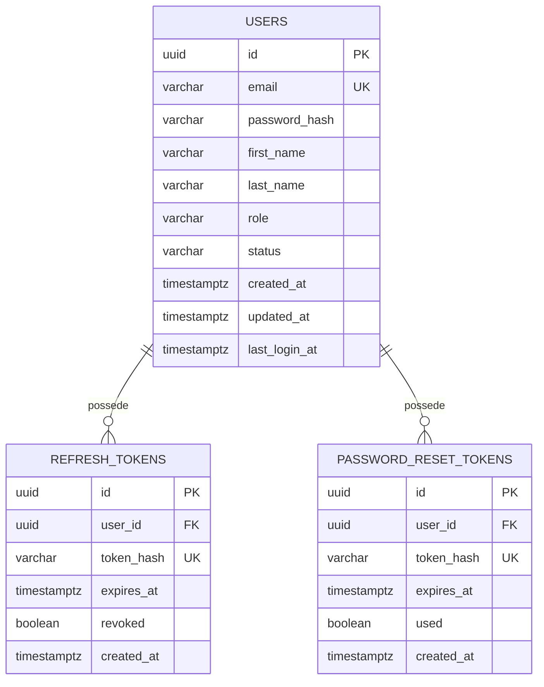

### 5.2 Domaine adresses (addresses)

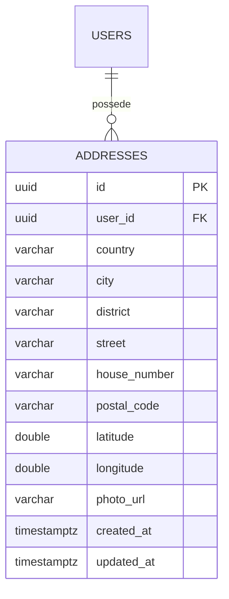
Contrainte `UNIQUE (user_id, country, city, district, street, house_number)` + FK physique
`user_id → users(id) ON DELETE CASCADE` (possible depuis la fusion en base unique — c'était une
référence logique sans FK à l'époque multi-bases) + trigger `trg_enforce_address_quota` (voir
`V5__enforce_address_quota_trigger.sql`).

### 5.3 Domaine support (support_tickets)

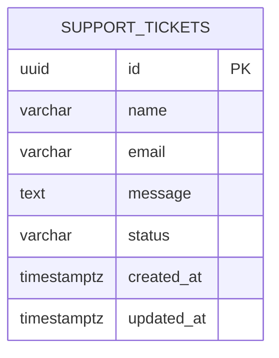
`support_tickets` ne duplique aucune donnée utilisateur/adresse (pas de colonne `user_id`) —
conformément au principe "pas de duplication de données métier", conservé malgré le passage à une
base unique.

---

## 6. Matrice RBAC complète

Légende : ✅ autorisé · 🔒 uniquement sur sa propre ressource · ❌ interdit · 🌐 public (pas de JWT requis).

| Endpoint | Méthode | Public | USER | SUPPORT_AGENT | ADMIN |
|---|---|:---:|:---:|:---:|:---:|
| `/api/auth/signup` | POST | 🌐 | 🌐 | 🌐 | 🌐 |
| `/api/auth/signin` | POST | 🌐 | 🌐 | 🌐 | 🌐 |
| `/api/auth/refresh` | POST | 🌐 (token valide requis) | ✅ | ✅ | ✅ |
| `/api/auth/logout` | POST | ❌ | ✅ | ✅ | ✅ |
| `/api/auth/forgot-password` | POST | 🌐 | 🌐 | 🌐 | 🌐 |
| `/api/auth/reset-password` | POST | 🌐 (token à usage unique) | 🌐 | 🌐 | 🌐 |
| `/api/users/me` | GET | ❌ | 🔒 | 🔒 | 🔒 |
| `/api/users/me` | PUT | ❌ | 🔒 | 🔒 | 🔒 |
| `/api/addresses` | GET | ❌ | 🔒 | 🔒 | 🔒 |
| `/api/addresses` | POST | ❌ | 🔒 (quota 4) | 🔒 (quota 4) | 🔒 (quota 4) |
| `/api/addresses/{id}` | GET | ❌ | 🔒 propriétaire | 🔒 propriétaire | 🔒 propriétaire |
| `/api/addresses/{id}` | PUT | ❌ | 🔒 propriétaire | 🔒 propriétaire | 🔒 propriétaire |
| `/api/addresses/{id}` | DELETE | ❌ | 🔒 propriétaire | 🔒 propriétaire | 🔒 propriétaire |
| `/api/addresses/{id}/photo` | POST | ❌ | 🔒 propriétaire | 🔒 propriétaire | 🔒 propriétaire |
| `/api/addresses/{id}/export` | GET | ❌ | 🔒 propriétaire | 🔒 propriétaire | 🔒 propriétaire |
| `/api/admin/users` | GET | ❌ | ❌ | ❌ | ✅ |
| `/api/admin/addresses` | GET | ❌ | ❌ | ❌ | ✅ |
| `/api/support` | POST | 🌐 | 🌐 | 🌐 | 🌐 |
| `/api/admin/support` | GET | ❌ | ❌ | ✅ | ✅ |
| `/api/admin/support/{id}` | PATCH | ❌ | ❌ | ✅ | ✅ |
| `/api/admin/users/{id}/role` *(additif)* | PATCH | ❌ | ❌ | ❌ | ✅ |
| `/api/admin/users/{id}/status` *(additif)* | PATCH | ❌ | ❌ | ❌ | ✅ |

Règles transversales :
- 🔒 « propriétaire » : le use case vérifie systématiquement `address.belongsTo(currentUserId)`
  avant lecture/écriture/suppression → sinon `403 Forbidden` (jamais `404`, pour ne pas fuiter
  l'existence de la ressource... *mais* le cahier des charges section 2.2 impose explicitement
  `404 Not Found` pour une adresse inexistante et `403 Forbidden` pour un accès à l'adresse
  d'un autre utilisateur : ces deux cas sont donc bien distingués, dans cet ordre — existence
  vérifiée avant propriété).
- Les rôles sont portés par la claim `role` du JWT et vérifiés via `@PreAuthorize("hasRole('ADMIN')")`
  (ou équivalent) sur chaque contrôleur/méthode sensible — jamais uniquement côté Gateway.

---

## 7. Stratégie de sécurité (JWT & RBAC)

### 7.1 Cycle de vie du token

- **Émission** : uniquement par `AuthService`, à l'issue de `signin` ou `signup`. Deux tokens :
  - **Access token** (JWT signé HMAC-SHA256, claims : `sub`=userId, `email`, `role`, `exp`) —
    durée de vie courte (15 min, configurable via `JWT_ACCESS_TTL_MINUTES`).
  - **Refresh token** (chaîne aléatoire opaque de 256 bits, `SecureRandom` — pas un JWT — dont
    seul le hash SHA-256 est persisté en base `refresh_tokens`, jamais le token en clair) — durée
    de vie longue (7 jours), **rotation à chaque refresh** :
    l'ancien est révoqué (`revoked=true`) et un nouveau est émis, ce qui permet de détecter le
    rejeu d'un refresh token volé (s'il est présenté après avoir déjà été utilisé une fois, tous
    les tokens de l'utilisateur sont révoqués par précaution).
- **Validation** : conforme au cahier des charges (section 2.4 : « validé par chaque service, ou
  par la Gateway, selon le choix retenu »). Dans l'architecture microservices d'origine, la
  validation se faisait en deux temps (Gateway puis service). Depuis la fusion en application
  unique (section 2), il n'y a plus qu'**un seul filtre JWT** (`JwtAuthenticationFilter`),
  appliqué une fois par requête avant tout contrôleur : il valide la signature et l'expiration,
  extrait `userId`/`email`/`role`, et alimente le `SecurityContext` consommé ensuite par
  `@PreAuthorize` sur les contrôleurs admin. La duplication de validation propre au découpage
  microservices n'a plus lieu d'être dans un seul process.
- **Révocation** : `logout` révoque le refresh token courant. `POST /api/admin/users/{id}/status`
  (désactivation de compte) invalide implicitement toute nouvelle tentative de refresh (vérification
  `status == ACTIVE` à chaque `refresh`/`signin`), même si un access token de courte durée reste
  valable jusqu'à son expiration naturelle (compromis assumé : 15 min max, documenté comme
  limitation connue dans le rapport de sécurité L9).
- **Stockage côté client** : hors périmètre backend (frontend), mais le contrat impose que le
  token soit transmis en en-tête `Authorization: Bearer <token>` — jamais en query param (fuite
  possible dans les logs/proxies).

### 7.2 Protection des endpoints

- Une seule `SecurityFilterChain` pour toute l'application : tout endpoint est protégé par défaut
  (`anyRequest().authenticated()`), seules les routes listées en section 6 comme 🌐 sont
  explicitement `permitAll()`.
- `@PreAuthorize("hasRole('ADMIN')")` / `hasAnyRole('ADMIN','SUPPORT_AGENT')` au niveau méthode
  des contrôleurs admin (`AdminUserController`, `AdminAddressController`, `AdminSupportController`).
- Vérification de propriété (adresses) : effectuée dans la couche `business` (`AddressService`), pas
  dans le contrôleur — c'est une règle métier, pas un détail HTTP.

### 7.3 Hashing & secrets

- Mots de passe : `BCrypt` (coût 10, `org.springframework.security.crypto.bcrypt.BCryptPasswordEncoder`),
  jamais loggés (les DTO de requête excluent le mot de passe des `toString()`/logs applicatifs).
- Tokens de réinitialisation : générés aléatoirement (`SecureRandom`, 32 octets, encodés base64url),
  seul leur hash SHA-256 est persisté — usage unique, expiration 30 min.
- Secrets (`JWT_SECRET`, identifiants PostgreSQL) : jamais en dur dans le code ni dans les images
  Docker — injectés via variables d'environnement (`docker-compose.yml` + `.env`, `.env` exclu du
  contrôle de version).

---

## 8. Stratégie de gestion des transactions

- **Périmètre `@Transactional`** : posé au niveau de la couche `application` (use cases), jamais
  dans les contrôleurs ni les repositories — un use case = une unité transactionnelle cohérente.
  Exemples : `SignupUseCase` (vérification unicité + insertion utilisateur + première émission de
  refresh token), `CreateAddressUseCase` (comptage du quota + vérification d'unicité + insertion,
  dans la même transaction pour éviter une *race condition* entre la lecture du compte et l'écriture).
- **Isolation** : niveau par défaut PostgreSQL (`READ COMMITTED`) jugé suffisant car le quota de 4
  adresses est protégé par un filet de sécurité supplémentaire au niveau base (trigger
  `trg_enforce_address_quota`, section 5.2) qui absorbe le cas limite d'une double requête
  concurrente sur le même compte (la transaction perdante échoue proprement avec une exception
  applicative traduite en `409 Conflict`, plutôt que de produire une 5ᵉ adresse).
- **Vues agrégées admin** : dans l'ancienne architecture microservices, `admin-service`
  interrogeait `auth-service`/`address-service` par REST synchrone et devait gérer les échecs
  réseau (`503 Service Unavailable`, timeout 3s). Depuis la fusion en application unique, les
  contrôleurs admin (`AdminUserController`, `AdminAddressController`) appellent directement
  `UserService`/`AddressService` en mémoire : plus d'appel réseau, donc plus de scénario
  d'indisponibilité partielle à gérer pour ces vues.
- **Rollback** : toute exception métier non contrôlée (`RuntimeException`) déclenche un rollback
  automatique Spring ; les exceptions métier attendues (ex. `EmailAlreadyUsedException`,
  `AddressQuotaExceededException`) sont volontairement des `RuntimeException` pour bénéficier de ce
  comportement par défaut, traduites ensuite en code HTTP par le `@RestControllerAdvice`.

---

## 9. Organisation des packages (arborescence type)

Application unique, package racine `com.geolink.findme`, structurée par tier (Présentation →
Métier → Accès données), plus deux packages transversaux (`security`, `config`) :

```
src/main/java/com/geolink/findme/
├── FindmeApplication.java
├── presentation/
│   ├── controller/   # AuthController, UserController, AddressController,
│   │                  AdminUserController, AdminAddressController, AdminSupportController,
│   │                  SupportController
│   ├── dto/           # SignupRequest, AuthResponse, AddressRequest, AddressResponse,
│   │                    SupportTicketResponse, ...
│   ├── mapper/         # UserWebMapper, AddressWebMapper, SupportWebMapper
│   └── advice/         # GlobalExceptionHandler (ProblemDetail RFC 7807, un seul pour toute l'app)
├── business/
│   ├── service/        # AuthService/AuthServiceImpl, UserService/UserServiceImpl,
│   │                     AddressService/AddressServiceImpl, SupportService/SupportServiceImpl,
│   │                     PhotoStorageService/FileSystemPhotoStorageService,
│   │                     QrCodeService/ZxingQrCodeService
│   │                     (chaque dépendance métier ou technique remplaçable = interface +
│   │                      implémentation `*Impl`, cf. section 2 "Respect de SOLID")
│   ├── validation/      # EmailPolicy, PasswordPolicy, AddressQuotaPolicy, GeoPointPolicy
│   │                     (helpers statiques, règles métier pures)
│   └── exception/       # EmailAlreadyUsedException, AddressQuotaExceededException, ...
├── data/
│   ├── entity/          # User, RefreshToken, PasswordResetToken, Address, SupportTicket
│   │                     (entités JPA anémiques : @Enumerated(STRING), pas de comportement métier)
│   └── repository/      # UserRepository, RefreshTokenRepository, AddressRepository, ...
│                         (interfaces Spring Data JpaRepository)
├── security/            # JwtService/JwtServiceImpl, JwtAuthenticationFilter, SecurityConfig,
│                          CorsConfig, CurrentUserProvider, RestAuthenticationEntryPoint,
│                          RestAccessDeniedHandler, SecureTokenGenerator/SecureTokenGeneratorImpl
└── config/               # OpenApiConfig, StaticFilesConfig (sert /files/** pour les photos)
```

**Règle de dépendance** (voir section 2) : `presentation` → `business` → `data`, jamais l'inverse.
Contrairement à l'ancienne architecture hexagonale (une couche `domain`/`application`/
`infrastructure`/`web` par microservice avec interfaces "ports"), la couche `business` injecte
directement les `JpaRepository` Spring Data — pas de couche d'abstraction supplémentaire, ce qui
correspond au modèle 3-tiers classique demandé pour ce livrable.

---

## 10. Conventions REST retenues

- **Nommage des ressources** : substantifs pluriels (`/api/addresses`), imbrication limitée à un
  niveau pour les sous-ressources (`/api/addresses/{id}/photo`).
- **Verbes HTTP** : `GET` (lecture, idempotent), `POST` (création ou action non idempotente comme
  l'upload), `PUT` (remplacement complet d'une ressource existante), `PATCH` (modification
  partielle — utilisé pour le statut d'un ticket ou d'un compte), `DELETE` (suppression).
- **Codes de statut** : `200` lecture/mise à jour réussie, `201` création (avec header `Location`),
  `204` suppression réussie sans corps, `400` requête invalide (Bean Validation), `401` non
  authentifié/token invalide, `403` authentifié mais non autorisé, `404` ressource inexistante,
  `409` conflit métier (email dupliqué, quota, adresse dupliquée), `422` (réservé pour une
  validation métier complexe multi-champs si besoin futur), `500` erreur non anticipée.
- **Pagination** : paramètres `page` (0-indexé) et `size`, mappés directement sur `Pageable` de
  Spring Data ; `sort` au format `champ,asc|desc`. Réponse de liste = `Page<T>` sérialisé par
  Spring (`content`, `totalElements`, `totalPages`, `number`, `size`) — pas d'enveloppe `{success,data}`
  personnalisée (voir décision de cadrage en tête de document).
- **Filtrage** : query params nommés d'après le domaine métier (`pays`, `ville`, `quartier`,
  `statut`), toujours optionnels, combinables.
- **Erreurs** : format homogène `ProblemDetail` (RFC 7807) via `@RestControllerAdvice` central par
  service — `type`, `title`, `status`, `detail`, `instance`, et une extension `errorCode` (ex.
  `EMAIL_ALREADY_USED`, `ADDRESS_QUOTA_EXCEEDED`) exploitable par le frontend sans parser le message.
- **Versionnement** : non appliqué dans cette itération (contrat figé, un seul consommateur
  officiel) ; si nécessaire plus tard, stratégie recommandée = préfixe d'URI (`/api/v2/...`)
  plutôt qu'un header, pour rester lisible par les partenaires B2B.
- **DTO systématiques** : aucune entité JPA ni objet de domaine n'est jamais sérialisé directement
  ; chaque contrôleur ne connaît que des DTO `web/dto`, mappés explicitement (mappers manuels,
  pas de bibliothèque de mapping magique, pour rester lisible en contexte pédagogique).

---

## 11. Stratégie de tests

**Pyramide visée** (par service) :

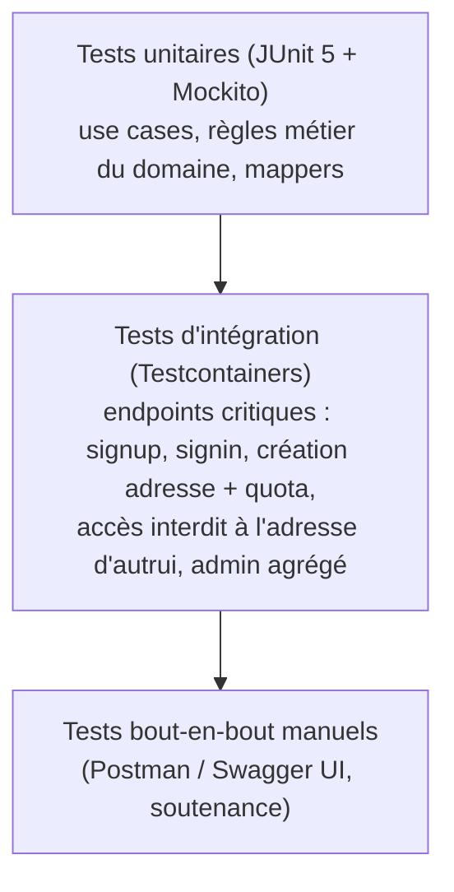

- **Tests unitaires** (majorité du volume) : ciblent `domain` et `application`, sans contexte
  Spring (`@ExtendWith(MockitoExtension.class)`), ports mockés. Couvrent explicitement les cas
  limites du cahier des charges (email dupliqué → 409, identifiants invalides → 401, quota
  dépassé → 409, accès à l'adresse d'autrui → 403, adresse inexistante → 404, token de
  réinitialisation expiré/déjà utilisé → 410/400, upload non conforme → 400).
- **Tests d'intégration** : `@SpringBootTest` + Testcontainers PostgreSQL (une instance par
  classe de test, migrations Flyway réellement exécutées) pour les endpoints critiques listés
  ci-dessus + vérification de la RBAC (`@WithMockUser`/JWT généré en test) sur les routes
  `/api/admin/**`.
- **Objectif de couverture** : ≥ 80 % sur `domain`+`application` (logique métier), ≥ 60 % global
  par service. Mesuré via `jacoco-maven-plugin` (rapport HTML dans `target/site/jacoco`), ajouté
  en semaine 4 avec les tests eux-mêmes.
- **Hors périmètre non-obligatoire** : tests de charge/performance (non demandés par le cahier
  des charges), circuit breaker (bonus explicitement optionnel).
